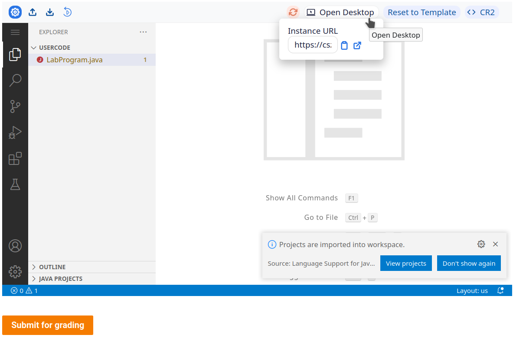
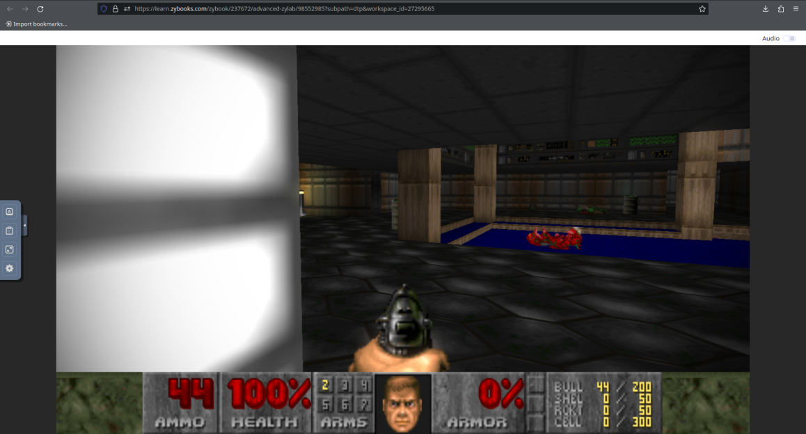

# This site runs on a textbook

## What exactly's going on

My Java class uses Zybooks, which uses some software that lets me pick what language and IDE to use, then gives me an Ubuntu container to code in, hosted on AWS. For example, here's [code-server](https://github.com/coder/code-server) with Java 11. And I also have remote desktop access over VNC via Apache Guacamole. But more interestingly, **I have root access.**



Here's what I did:

1. Loaded up the bash + code-server environment
2. Installed and ran nginx
3. Eternally create, modify, and delete file to keep the container alive.
   1. (In)activity detection is based off whether any files on /usercode have been modified in *x* minutes.
   2. The page also needs to be open, so I've got that running in a little VM on my server.
4. Set up remote port-forwarding from my server
   1. See [here](https://serverfault.com/questions/861909/ssh-r-make-target-host-accept-connection-on-all-interfaces) for details on that.
5. Have caddy reverse-proxy [textbook.askiiart.net](https://textbook.askiiart.net) to the container (via the forwarded port).

## But can it run DOOM?

Yes, yes it can!



## But can it run Crysis?

Probably not. But if anyone knows how to run Crysis on this thing, I'd be happy to try, [just let me know](mailto:dev@askiiart.net).

## Some other stuff

1. I have no idea how to make a fancier site, but it turns out that the 1GB I have is just enough to run a Next.js site, and access it from Midori. [Here's](https://github.com/askiiart/this-site-runs-on-a-textbook/blob/main/install-node-npm.sh) a script for installing Node.js and npm.
2. Here's the neofetch results:

    ```txt
    ➜ neofetch
                .-/+oossssoo+/-.
            `:+ssssssssssssssssss+:`
          -+ssssssssssssssssssyyssss+-
        .ossssssssssssssssssdMMMNysssso.
       /ssssssssssshdmmNNmmyNMMMMhssssss/      mysql@f76bb9853566 
      +ssssssssshmydMMMMMMMNddddyssssssss+     ------------------ 
     /sssssssshNMMMyhhyyyyhmNMMMNhssssssss/    OS: Ubuntu 20.04.5 LTS x86_64 
    .ssssssssdMMMNhsssssssssshNMMMdssssssss.   Host: t3.xlarge 
    +sssshhhyNMMNyssssssssssssyNMMMysssssss+   Kernel: 5.15.0-1034-aws 
    ossyNMMMNyMMhsssssssssssssshmmmhssssssso   Uptime: 11 hours, 35 mins 
    ossyNMMMNyMMhsssssssssssssshmmmhssssssso   Packages: 697 (dpkg) 
    +sssshhhyNMMNyssssssssssssyNMMMysssssss+   Shell: bash 5.0.17 
    .ssssssssdMMMNhsssssssssshNMMMdssssssss.   Resolution: 1366x768 
     /sssssssshNMMMyhhyyyyhdNMMMNhssssssss/    WM: IceWM 1.6.4 (Linux/x86_64) 
      +sssssssssdmydMMMMMMMMddddyssssssss+     WM Theme: default.theme 
       /ssssssssssshdmNNNNmyNMMMMhssssss/      Theme: Adwaita [GTK3] 
        .ossssssssssssssssssdMMMNysssso.       Icons: Adwaita [GTK3] 
          -+sssssssssssssssssyyyssss+-         Terminal: vscode 
            `:+ssssssssssssssssss+:`           CPU: Intel Xeon Platinum 8259CL (4) @ 2.499GHz 
                .-/+oossssoo+/-.               Memory: 2388MiB / 15815MiB 
    ```

3. Other port-forwarding stuff, like [localtunnel](https://github.com/localtunnel/localtunnel), are blocked. [`wstunnel`](https://github.com/erebe/wstunnel) might work, and it's also rather convenient that it has a static binary, but I haven't tried it yet.
4. My server occasionally crashes, and I'm still trying to figure. Sorry if the site goes offline for a bit, but if it does, it should be back up soon. Also, it's rather funny that my textbook is more reliable than my actual server.
   1. If you're interested, I'm running Debian 12 in a VM, all I've got installed is Docker. I've checked journalctl, my RAM, and I verified the installation media. I'm not sure what else to check, but I'm certainly open to suggestions.
